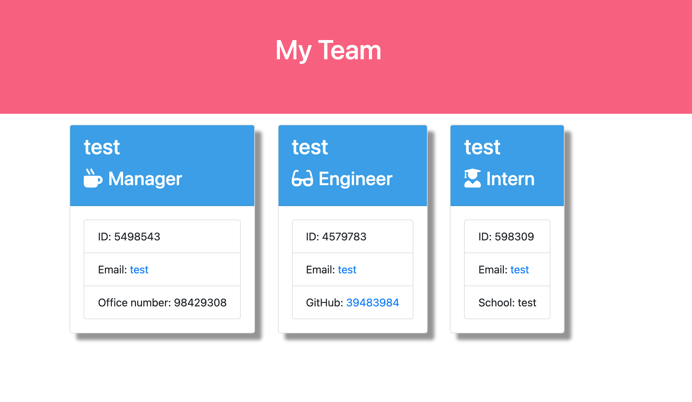

# Team-Profile-Generator

# Repo Link:

https://github.com/chronoslou/Team-Profile-Generator

# App Link

https://limitless-inlet-99972.herokuapp.com/

## Description

This a Node.js command-line application that takes in information about employees on a software engineering team, then generates an HTML webpage that displays summaries for each person. Additionally, unit testing for every part of the code has been created to ensure maintainabilty.

This application allows the user to generate a webpage that displays the team's basic information including emails and Github profiles.

## Usage

The application will be invoked by using the following command:

- The application will accept a user's input through command-line.
- The application asks the end user for the team member's information.
- The user will be prompted to enter the team manager’s name, employee ID, email address, and office number.
- After entering the team manager's information then the user is presented with an option menu to add an engineer or an intern or to finish building the team.
- When the user selects the engineer option, then the following questions will prompted (engineer’s name, ID, email, and GitHub username) and then the user is taken back to the menu.
- When the user selects the intern option, then the following questions will be prompted (intern’s name, ID, email, and school) and then the user is taken back to the menu.
- After the sequence of questions ends, a HTML file is generated that displays a nicely formatted team roster based on user inputs.
- The HTML page is interactive and when the email address in the HTML is clicked then it opens the default email program of the user and populates the TO field of the email with the address.
- When the GitHub username is clicked then the selected GitHub profile opens in a new tab in the browser.

## Installation

Modules to install:

- [Jest](https://www.npmjs.com/package/jest) for running the unit tests.
- [Path] (https://www.npmjs.com/package/path) for working with directories and file path.
- [Inquirer](https://www.npmjs.com/package/inquirer) for collecting input from the user.

The application will be invoked by using the following command:

- node index.js

## Preview of App

- This is how the app looks

# Lincense

- MIT
